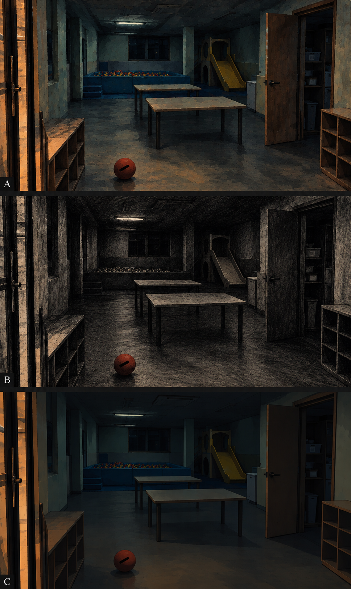
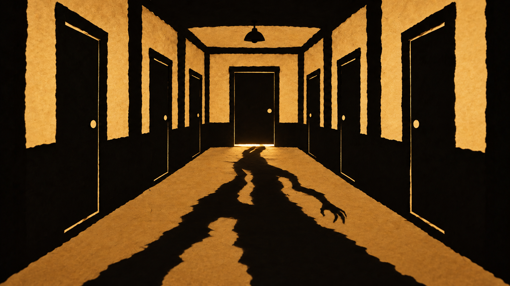
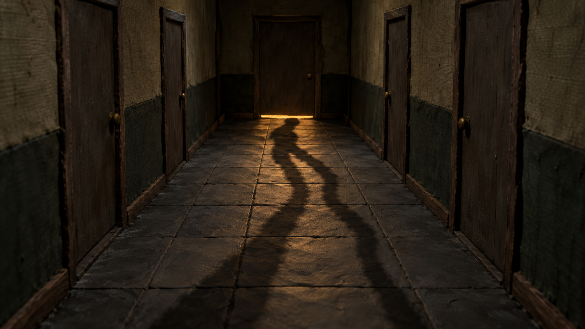
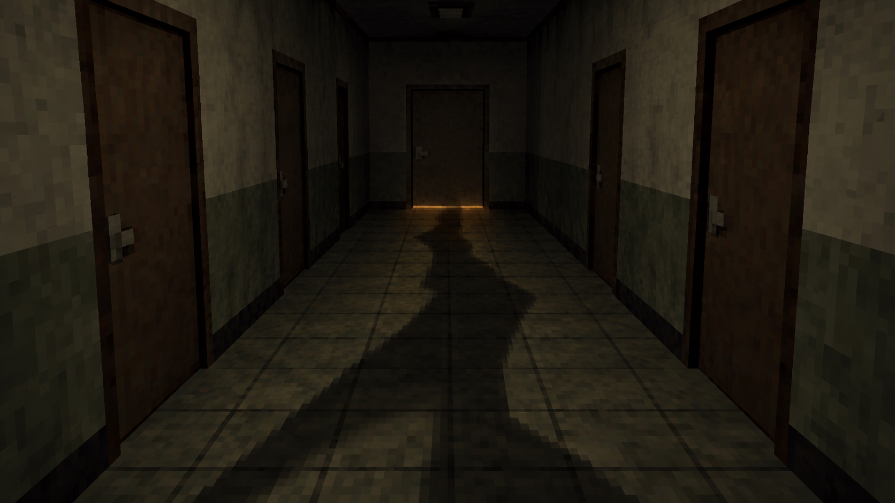
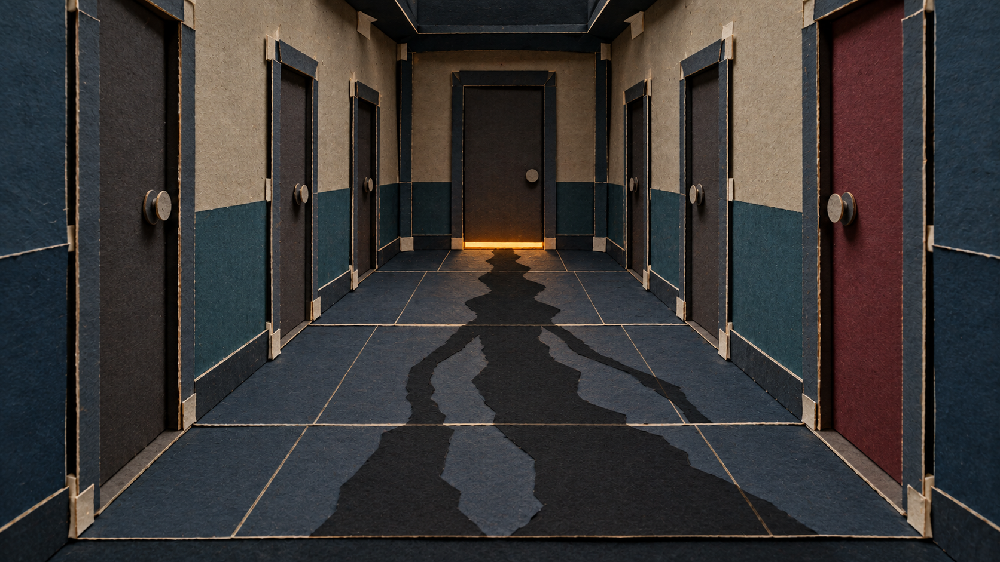
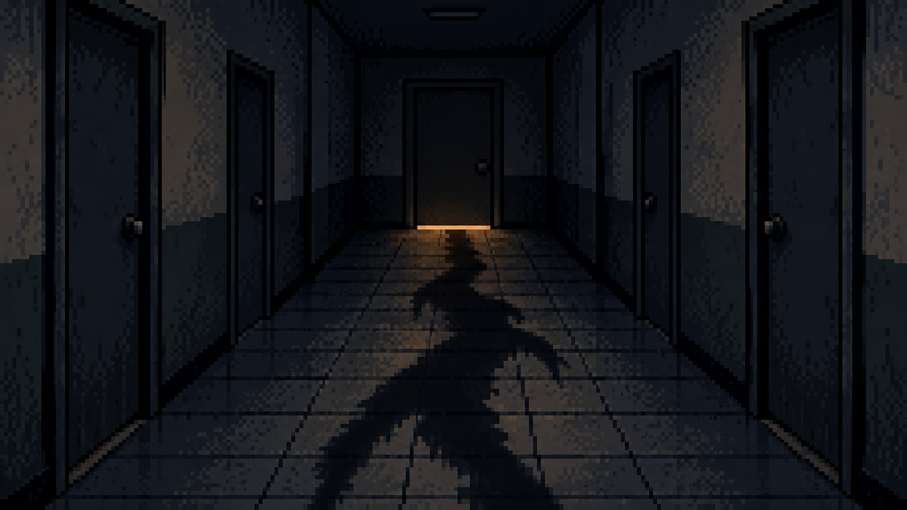

# 공포 이야기 시각 스타일 9가지

이 목록은 향후 이야기마다 선택할 수 있는 표현 방식입니다. 특정 스타일을 고정하지 않고 이야기의 소재와 분위기에 맞춰 추천합니다. 비실사 8가지와 기존 실사풍 1가지를 포함합니다. 일반 설명형 영상용 스타일은 별도 목록입니다.

설정 원본은 [visual-styles.json](../config/visual-styles.json)의 `horror_story_selection`과 `styles`입니다. 제작 프로필은 `horror_cinematic_story_v1`을 사용하며, 회화·인형·게임 등은 그 프로필 안의 이미지 표현 방식입니다. 표의 추천 소재는 연출 판단 기준이며 성과가 검증된 순위는 아닙니다.

스타일을 선택할 때 [이야기별 편집 기법](HORROR_EDITING_TECHNIQUES.ko.md)도 함께 검토합니다. 소재·단서·긴장 단계에 맞는 주된 기법과 보조 기법을 고르고, 각 스타일의 재료·윤곽·움직임에 맞춰 적용합니다.

## 스타일 목록

| 번호 | 스타일 | 핵심 표현 | 잘 맞는 이야기 | 스타일 ID |
| --- | --- | --- | --- | --- |
| 1 | 어두운 회화풍 | 거친 과슈·유화 | 귀신 괴담·괴물·미확인 존재·숲·시골 괴담 | `horror_painterly` |
| 2 | 먹·목탄풍 | 번지는 먹·문지른 목탄 | 원혼·귀신·악몽·심리·미스터리 공포 | `horror_ink_charcoal` |
| 3 | 거친 2D 애니메이션풍 | 손으로 칠한 배경과 거친 외곽선 | 도시괴담·야간 직업괴담·장소 이동이 많은 이야기 | `horror_rough_2d` |
| 4 | 그림자극 | 평면 검은 종이 실루엣 | 그림자 귀신·문틈·실루엣 괴담·민담 | `horror_shadow_theatre` |
| 5 | 인형극·스톱모션풍 | 낡은 천·거친 나무·손자국 있는 점토 | 인형·장난감 괴담·어린 시절 기억·기묘한 집·공간 | `horror_puppet_stopmotion` |
| 6 | 초기 3D 공포게임풍 | 거친 저해상도 텍스처·단순 폴리곤 | 규칙괴담·엘리베이터·미로·현대 기기·게임 괴담 | `horror_retro_3d` |
| 7 | 종이 무대·컷아웃풍 | 겹친 카드지·접힘·절단면 | 어두운 동화·민담·의식·금기 괴담·기묘한 공간 | `horror_paper_stage` |
| 8 | 픽셀아트 공포풍 | 거친 픽셀·디더링·계단 윤곽 | 현대 기기·게임 괴담·고립된 야간 공간·규칙괴담 | `horror_pixel` |
| 9 | 실사풍·호러 시네마틱 | 저조도 사실적 공간과 국소 조명 | 일상 공간·야간 직업·CCTV 괴담 | `horror_cinematic` |

실사풍은 익숙한 공간의 현실감을 강조할 때 검토합니다. 비실사 후보도 함께 검토하며, 이전 이야기의 스타일을 자동으로 이어 쓰지 않습니다. 기존 `dark_cinematic`은 그래픽 중심의 공포·경고 연출 후보로 계속 사용할 수 있지만 위에서 비교한 9가지 이미지 스타일의 개수에는 별도로 더하지 않습니다.

## 새 이야기에서 추천하는 방법

1. 장소와 시대, 위협의 형태, 핵심 단서, 감정선, 이동·접촉 장면을 확인합니다.
2. 우선 추천 한 가지와 대안 한두 가지를 제시합니다. 각 후보의 적합 이유, 밝기, 팔레트, 질감, 모션, 모바일 단서 가독성을 함께 설명합니다.
3. 최근 이야기의 승인 스타일을 확인해 다양성을 고려합니다. 정해진 순서대로 돌리거나 이야기와 맞지 않는 스타일을 강제하지 않습니다.
4. 사용자가 해당 이야기의 스타일을 선택하거나 선택을 명시적으로 위임하면 그 범위에서 결정합니다. 이 목록의 정리 승인은 특정 스타일의 제작 승인이 아닙니다.
5. 브리프에 추천·대안·선정 이유·승인 또는 위임 근거를 기록하고, 씬 플랜과 제작·납품 메타데이터에는 선택한 스타일 ID를 일치시킵니다.

### 추천을 설명하는 예시

- 그림자만 다르게 움직이는 방: **그림자극** 우선, **먹·목탄풍** 대안. 위협의 실루엣과 문틈이 핵심이기 때문입니다.
- 낡은 인형이 자리를 옮기는 집: **인형극·스톱모션풍** 우선, **어두운 회화풍** 대안. 물건의 재질과 접촉이 공포를 만들기 때문입니다.
- 층마다 규칙이 달라지는 엘리베이터: **초기 3D 공포게임풍** 우선, **거친 2D 애니메이션풍** 대안. 공간의 이동과 반복 구조가 핵심이기 때문입니다.
- 마을의 오래된 금기와 의식: **종이 무대·컷아웃풍** 우선, **어두운 회화풍** 대안. 어두운 동화 같은 분위기를 활용할 수 있기 때문입니다.
- 오래된 게임 화면에서 시작되는 괴담: **픽셀아트 공포풍** 우선, **초기 3D 공포게임풍** 대안. 기기의 표현 방식과 서사가 이어지기 때문입니다.

예시는 고정 배정이 아닙니다. 같은 소재라도 핵심 단서와 감정선에 따라 달라집니다.

## 공통 제작 기준

- 어둡고 음침한 분위기는 배경 디테일·채도·주변광을 절제해 만듭니다. 화면 전체를 흐리거나 검게 지워 단서를 숨기지 않습니다.
- 한 작품의 본편·쇼츠·썸네일은 승인된 시각 언어를 공유합니다. 쇼츠는 독립 대본·음성과 새 세로 이미지로 제작합니다.
- 귀신·괴물의 형태와 공간 구조, 손·물체 접촉은 해당 스타일에서도 읽혀야 합니다.
- 인형극·스톱모션풍 시안은 정지 이미지의 재질 제안입니다. 실제 스톱모션 촬영이나 프레임별 캐릭터 애니메이션이 자동으로 완성되는 것은 아닙니다.
- 픽셀아트 시안의 논리 해상도·색상 수는 인증된 값이 아닙니다. 실제 제작에서는 보간과 확대가 단서를 흐리지 않는지 확인합니다.
- BGM은 스타일에 맞는 공포 프롬프트로 새 후보를 준비하고 기존 승인 절차로 선정합니다.
- 이미지마다 원본 검사와 대본·인접 장면 대조 검사를 수행합니다. 이후 영상 크롭·모션도 검수합니다.

## 비교 시안

### 앞서 비교한 3가지

위부터 어두운 회화풍, 먹·목탄풍, 거친 2D 애니메이션풍입니다.

[생성 프롬프트](../experiments/2026-10-05-horror-illustration-style/prompts.json) · [검수 기록](../experiments/2026-10-05-horror-illustration-style/review.json)

### 추가로 비교한 5가지

#### 그림자극

#### 인형극·스톱모션풍

#### 초기 3D 공포게임풍

#### 종이 무대·컷아웃풍

#### 픽셀아트 공포풍

[생성 프롬프트](../experiments/2026-10-05-horror-style-gallery/prompts.json) · [개별 이미지 두 차례 검수 기록](../experiments/2026-10-05-horror-style-gallery/image-review.json)

시안은 표현 방식 비교용입니다. 향후 이야기의 최종 제작 자산은 승인된 설정과 이야기의 인물·장소·존재 기준에 맞춰 새로 생성합니다.
